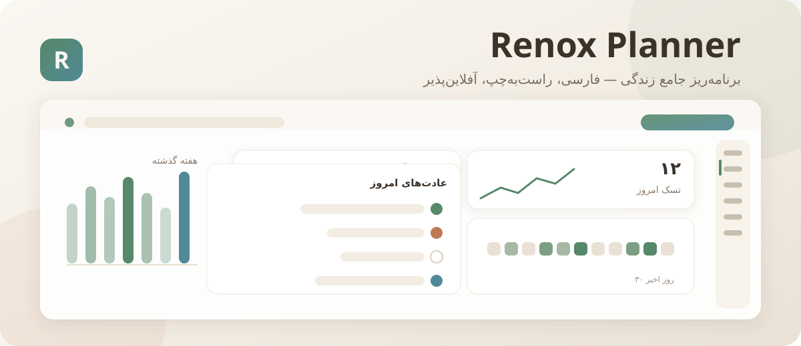

<div dir="rtl">

# 📋 Renox Planner — برنامه‌ریز جامع زندگی

> **همه‌چیزِ برنامه‌ریزی زندگی در یک برنامه فارسی، راست‌به‌چپ، آفلاین‌پذیر و کاملاً رایگان.**
> از تسک و عادت روزانه تا تقویم شمسی، بودجه، سلامت، ژورنال و گزارش — بدون اشتراک، بدون تبلیغ، بدون سرور.

<p align="center">
  <a href="#"></a>
  <a href="#"></a>
  <a href="#"></a>
  <a href="#"></a>
  <a href="https://github.com/Pillow1243/Renox-Planner/actions"></a>
  <a href="#-تست‌ها"></a>
</p>

---

## 🗂 فهرست مطالب

1. [بخش ۱ — پیش‌نمای برنامه و قابلیت‌ها](#۱-پیش‌نمای-برنامه-و-قابلیت‌ها)
2. [بخش ۲ — قابلیت‌های کامل](#۲-قابلیت‌های-کامل)
3. [بخش ۳ — پشته فناوری](#۳-پشته-فناوری-stack)
4. [بخش ۴ — نصب و اجرا در ۶۰ ثانیه](#۴-نصب-و-اجرا-در-۶۰-ثانیه)
5. [بخش ۵ — متغیرهای محیطی](#۵-متغیرهای-محیطی)
6. [بخش ۶ — ساختار پروژه](#۶-ساختار-پروژه)
7. [بخش ۷ — مستندات APIها](#۷-مستندات-apiها)
8. [بخش ۸ — انتشار و استقرار](#۸-انتشار-و-استقرار)
9. [بخش ۹ — مشارکت](#۹-مشارکت)
10. [بخش ۱۰ — مجوز و سپاسگزاری](#۱۰-مجوز-و-سپاسگزاری)

---

## ۱) پیش‌نمای برنامه و قابلیت‌ها

<p align="center">
  
</p>

| صفحه | چه می‌کند |
| --- | --- |
| 🏠 **داشبورد** | کارت‌های آماری با اعداد بزرگ و اسپارک‌لاین، نمودار هفته، عادت‌های امروز، نقل‌قول روز، آب‌وهوا و رویدادهای پیش‌رو — همه قابل جابه‌جایی با Drag & Drop |
| ✅ **تسک‌ها** | CRUD کامل، زیرتسک، تکرار، برچسب، نمایش لیست/کانبان/آیزنهاور، جابه‌جایی بین ستون‌ها با dnd-kit |
| 📁 **پروژه‌ها** | دسته‌بندی تسک‌ها با نوار پیشرفت، تاریخ سررسید، تسک بعدی و بایگانی |
| 🎯 **اهداف و OKR** | افق کوتاه/میان/بلندمدت، نتایج کلیدی با نوار پیشرفت، کاغذرنگیِ تکمیل همه نتایج |
| 🔥 **عادت‌ها** | زنجیره (Streak)، هیتمپ ۱۸۲ روزه، کاغذرنگی، عادت خوب/بد و فراوانی سفارشی |
| 🗓 **تقویم شمسی** | نمای ماه/هفته/روز، تعطیلات رسمی ایران، نقطه‌های رنگی رویداد، افزودن سریع با کلیک روی روز |
| ⏱ **تمرکز و پومودورو** | تایمر ۲۵/۵ با صدای زنگ، حالت‌های سفارشی، اتصال به تسک و آمار کار عمیق |
| 📝 **یادداشت‌ها** | ویرایشگر غنی TipTap، پوشه‌ها، سنجاق‌کردن، جست‌وجو و رنگ‌بندی |
| 📔 **ژورنال** | صفحه کاغذی بافت‌دار، حال‌وهوا با ۵ ایموجی، انرژی، قدردانی، درس‌ها و عکس روز |
| 💰 **مالی** | درآمد/هزینه/انتقال، دسته‌ها، بودجه ماهانه، چند حساب، نرخ ارز و رمزارز زنده |
| ❤️ **سلامت** | BMI و ناحیه‌ها، وزن/خواب/آب/قدم، ورزش، تغذیه (Open Food Facts) و داروها |
| 📊 **گزارش‌ها** | بازه روز/هفته/ماه/سال، ۴ حلقه پیشرفت، روند روزانه، جریان درآمد-هزینه، خروجی CSV و PDF |
| 🔍 **جست‌وجوی سراسری** | جست‌وجو در تسک، یادداشت، ژورنال، رویداد، تراکنش، هدف، پروژه و عادت با برجسته‌سازی نتیجه |
| ⚙️ **تنظیمات** | تم/رنگ تأکیدی، ناحیه زمانی، شهر، اهداف آب و خواب، اعلان‌ها، کلیدهای API، پشتیبان JSON |
| ⋯ **بیشتر** | هاب موبایل: میان‌بر افزودن سریع، همه بخش‌ها، آمار داده‌ها و اطلاعات نسخه |

**تجربه کاربری:** شروع سه‌مرحله‌ای (اهداف → عادت‌ها → معرفی) • میان‌برهای `Cmd+K`، `Cmd+N`، `Cmd+J`، `Cmd+/` •
دکمه شعاعی افزودن سریع روی موبایل • نوار پایین پنج‌تبی • اعلان‌های رنگی • اسکلتون‌های درخشان • حالت روشن/تیره/سیستم با گذار نرم.

---

## ۲) قابلیت‌های کامل

<details open>
<summary><b>مدیریت تسک و پروژه</b></summary>

- افزودن/ویرایش/حذف با دیالوگ تمام‌صفحه (شماره ۱ اولویت UI: کشویی از پایین روی موبایل)
- زیرتسک‌ها با تیک مستقل، تخمین زمان و زمان صرف‌شده
- تکرار: روزانه، روزهای کاری، هفتگی، ماهانه، سالانه (تولید نوبت بعدی هنگام تیک‌زدن)
- ماتریس آیزنهاور (مهم/فوری) و نمای کانبان با Drag & Drop
- برچسب، پیوست، یادآور و پیوند به پروژه و هدف
</details>

<details>
<summary><b>عادت‌ها و انگیزه</b></summary>

- زنجیره جاری و بهترین زنجیره، نرخ پایبندی ۳۰ روزه
- هیتمپ گیت‌هابی با پنج سطح رنگ
- عادت «خوب» و «بد» (مثل سیگار نکشیدن)، هدف تعداد در روز
- کاغذرنگی (Confetti) هنگام تکمیل — با احترام به `prefers-reduced-motion`
</details>

<details>
<summary><b>مالی</b></summary>

- مدل چند‌حسابی (نقد، بانک، کارت، رمزارز) و دسته‌بندی درآمد/هزینه/انتقال
- تبدیل ارز به واحد پایه و نمایش جمع‌ها به تومان/میلیون
- بودجه ماهانه با نوار مصرف و هشدار عبور از سقف
- نرخ ارز و قیمت رمزارز به‌صورت زنده از APIهای رایگان (با کش و جایگزین)
</details>

<details>
<summary><b>سلامت</b></summary>

- BMI با حلقه رنگی و پنج ناحیه، نمودار ۳۰ روزه وزن/خواب/آب و میله‌های ۱۴ روزه قدم
- انیمیشن پرشدن لیوان آب با کلیک، اسلایدر خواب، ۵ ایموجی حال‌وهوا
- ورزش (Wger)، تغذیه (Open Food Facts) و داروها با زمان مصرف
</details>

<details>
<summary><b>گزارش و تحلیل</b></summary>

- بازه‌های روز/هفته/ماه/سال با محاسبه دقیق تاریخ شمسی
- ۱۲ شاخص کلیدی: تسک انجام‌شده/ایجادشده، نرخ تکمیل، دقایق تمرکز، نرخ عادت،
  درآمد، هزینه، میانگین خواب، میانگین آب، دقایق ورزش و زنجیره ژورنال
- الگوی روزهای هفته، عملکرد پروژه‌ها و عادت‌ها، خروجی CSV (با BOM برای Excel فارسی) و چاپ PDF
</details>

<details>
<summary><b>حریم خصوصی و داده</b></summary>

- ذخیره‌سازی محلی (`localStorage`) با نسخه‌بندی و مهاجرت خودکار
- پشتیبان‌گیری JSON یک‌کلیکی + بازگردانی + داده نمونه
- مسیر ارتقا به Full-Stack (PostgreSQL + NextAuth + Prisma) بدون تغییر UI
</details>

---

## ۳) پشته فناوری (Stack)

<p align="center">
  
  
  
  
  
  
  
  
  
  
  
  
  
</p>

| لایه | فناوری |
| --- | --- |
| فریم‌ورک | Next.js 14 (App Router) با `output: 'export'` |
| زبان و تایپ | TypeScript 5 (strict) — همه ماژول‌ها با **کامنت فارسی** |
| ظاهر | Tailwind CSS 3.4 + توکن‌های CSS (`rgb(var(--x))`)، شیشه‌ای‌سازی `backdrop-blur-xl` |
| وضعیت | Zustand 4 با `persist` + TanStack Query 5 برای کش APIها |
| نمودار | Recharts (نمودار میله‌ای، ناحیه، دایره‌ای و اسپارک‌لاین) با برچسب‌های فارسی |
| حرکت | Framer Motion 11 (۲۰۰–۳۰۰ms، منحنی `cubic-bezier(0.22,1,0.36,1)`) |
| Drag & Drop | dnd-kit (کانبان تسک‌ها و ترتیب کارت‌های داشبورد) |
| ویرایشگر | TipTap 2 (یادداشت و ژورنال) |
| تاریخ | موتور تقویم شمسی اختصاصی (`lib/jalali.ts`) بدون وابستگی سنگین |
| سرور اختیاری | Prisma 5 + PostgreSQL + NextAuth 4 + API Routes (`server/`) |
| PWA | `manifest.json` + Service Worker با استراتژی Network-First و کش صفحه‌ها |

---

## ۴) نصب و اجرا در ۶۰ ثانیه

```bash
# ۱) دریافت کد
git clone https://github.com/Pillow1243/Renox-Planner.git
cd Renox-Planner

# ۲) نصب بسته‌ها
npm install

# ۳) اجرا (بدون نیاز به هیچ کلید یا پایگاه‌داده‌ای!)
npm run dev
# → http://localhost:3000
```

**اسکریپت‌های موجود:**

| دستور | کار |
| --- | --- |
| `npm run dev` | اجرای سرور توسعه روی `0.0.0.0:3000` |
| `npm run build` | ساخت نسخه تولیدی استاتیک در `out/` |
| `npm run build:pages` | ساخت با مسیر پایه `/Renox-Planner` برای GitHub Pages |
| `npm start` | سرو کردن خروجی استاتیک |
| `npm run lint` | بررسی ESLint |
| `npm run typecheck` | بررسی تایپ‌ها با `tsc --noEmit` |
| `npm test` | اجرای ۴۱ تست واحد (هسته شمسی، محاسبات، فروشگاه، APIها) |
| `npm run server:enable` | فعال‌سازی حالت Full-Stack (Prisma + NextAuth + API Routes) |
| `npm run db:seed` | بارگذاری داده نمونه سروری (فقط پس از فعال‌سازی) |

> ⚙️ **حالت Full-Stack (اختیاری):** اگر ورود کاربران و پایگاه‌داده می‌خواهی،
> `npm run server:enable` را بزن؛ همه فایل‌های آماده (`server/`) به مسیرهای واقعی کپی می‌شوند.
> راهنمای گام‌به‌گام: [`server/README.md`](server/README.md)

---

## ۵) متغیرهای محیطی

```bash
cp .env.example .env
```

| متغیر | لازم؟ | توضیح |
| --- | --- | --- |
| `NEXT_PUBLIC_SERVER_MODE` | خیر | `local` (پیش‌فرض) یا `server` |
| `DATABASE_URL` | فقط سروری | رشته اتصال PostgreSQL (یا SQLite) |
| `NEXTAUTH_SECRET` | فقط سروری | `openssl rand -base64 32` |
| `GOOGLE_CLIENT_ID` / `GOOGLE_CLIENT_SECRET` | خیر | ورود با گوگل (رایگان) |
| `TELEGRAM_BOT_TOKEN` / `TELEGRAM_CHAT_ID` | خیر | اعلان تلگرام (رایگان، از `@BotFather`) |
| `NEXT_PUBLIC_VAPID_PUBLIC_KEY` / `VAPID_PRIVATE_KEY` | خیر | اعلان Web Push (`npx web-push generate-vapid-keys`) |
| `NEXT_PUBLIC_GROQ_API_KEY` | خیر | خلاصه‌سازی هوشمند ژورنال |
| `NEXT_PUBLIC_ALPHA_VANTAGE_KEY` | خیر | سهام (۲۵ درخواست رایگان/روز) |
| `NEXT_PUBLIC_TMDB_API_KEY` / `NEXT_PUBLIC_OMDB_API_KEY` | خیر | فهرست تماشا |
| `NEXT_PUBLIC_CURRENTS_API_KEY` | خیر | کارت خبر داشبورد |
| `NEXT_PUBLIC_HF_API_KEY` | خیر | تحلیل احساسات متن |

**هیچ‌کدام اجباری نیستند.** برنامه به‌صورت پیش‌فرض با بیش از ۲۰ سرویس رایگان و بدون کلید کار می‌کند.
جدول کامل در [`.env.example`](.env.example) و توضیح همه سرویس‌ها در [`API_INTEGRATIONS.md`](API_INTEGRATIONS.md).

---

## ۶) ساختار پروژه

```
renox-planner/
├── app/
│   ├── (auth)/                     # ورود، ثبت‌نام، بازیابی رمز (چیدمان دوقسمتی)
│   ├── (dashboard)/                # همه صفحات برنامه با چیدمان مشترک AppShell
│   │   ├── page.tsx                # داشبورد (کارت‌های قابل جابه‌جایی)
│   │   ├── tasks/ projects/ goals/ habits/ calendar/ focus/
│   │   ├── notes/ journal/ finance/ health/ reports/ search/ settings/ more/
│   │   └── layout.tsx              # سایدبار + نوار بالا + تب‌بار موبایل + FAB
│   ├── globals.css                 # توکن‌های رنگ، کلاس‌های شیشه‌ای، حالت چاپ
│   ├── layout.tsx                  # فونت وزیرمتن، RTL، متادیتای PWA
│   └── providers.tsx               # Theme، React Query، Toast، Onboarding
├── components/
│   ├── ui/                         # primitives، icon، modal، toast، charts، heatmap، confetti
│   ├── layout/                     # sidebar، topbar، mobile-tabbar، radial-fab، command-palette
│   └── shared/                     # dialogs (۱۶ دیالوگ)، task-dialog، rich-editor، jalali-date-picker
├── lib/
│   ├── jalali.ts                   # موتور تقویم شمسی (تبدیل، شبکه ماه، قالب‌بندی)
│   ├── external-apis.ts            # دروازه همه APIهای رایگان + صف درخواست + کش
│   ├── selectors.ts                # منطق محاسباتی خالص (قابل تست)
│   ├── constants.ts  types.ts  utils.ts  seed.ts
├── stores/planner-store.ts         # فروشگاه Zustand + persist + پشتیبان‌گیری
├── hooks/use-planner.ts            # هوک‌های مشترک (hotkeys، media query، undo)
├── public/                         # manifest.json، sw.js، آیکون‌ها
├── server/                         # حالت Full-Stack آماده (Prisma، NextAuth، API Routes)
│   ├── prisma/schema.prisma        # ۲۸ مدل با روابط کامل
│   ├── prisma/migrations/          # مایگریشن اولیه SQL
│   ├── prisma/seed.ts              # داده نمونه فارسی
│   └── api/                        # CRUD همه موجودیت‌ها + sync + notify + report
├── tests/                          # ۴۱ تست (jalali، selectors، utils/store، external-apis)
├── scripts/enable-server.mjs       # فعال‌ساز حالت سروری
├── docs/banner.svg                 # تصویر معرفی
├── .github/workflows/deploy.yml    # CI/CD انتشار روی GitHub Pages
├── API_INTEGRATIONS.md             # مستند کامل APIها
├── .env.example
└── README.md
```

---

## ۷) مستندات APIها

📄 **[`API_INTEGRATIONS.md`](API_INTEGRATIONS.md)** — جدول کامل ۲۵ سرویس فعال با:
نام، دسته در مخزن public-apis، لینک مخزن، وضعیت `Auth`، محدودیت نرخ رایگان، ماژول مصرف‌کننده و **راهکار جایگزین**.

خلاصه رویکرد:

- پیش از کدنویسی، کل مخزن [public-apis](https://github.com/public-apis/public-apis) بررسی شد:
  **۵۲ دسته، ۲۰۳۶ API** (۹۶۸ بدون احراز هویت).
- همه فراخوانی‌ها از یک دروازه واحد می‌گذرند: `lib/external-apis.ts` با **صف درخواست** (احترام به محدودیت نرخ)،
  **کش TTL چندلایه** و **جایگزین محلی** — اگر سرویسی قطع شود، UI هرگز نمی‌شکند.
- هیچ API پولی و هیچ OAuth پولی استفاده نمی‌شود. قوانین و جدول ردها در همان سند.

---

## ۸) انتشار و استقرار

### الف) GitHub Pages (پیش‌فرض و رایگان)

```bash
npm run build:pages      # ساخت با basePath = /Renox-Planner
# خروجی در پوشه out/ آماده آپلود است
```

انتشار **خودکار** با GitHub Actions (فایل [`.github/workflows/deploy.yml`](.github/workflows/deploy.yml)):

1. هر push روی شاخه `main` → اجرای تست، لینت و بیلد.
2. آپلود پوشه `out/` به‌عنوان artifact.
3. انتشار روی Pages و در دسترس بودن در `https://<username>.github.io/Renox-Planner/`.

> **راه‌اندازی یک‌باره:** در مخزن → `Settings` → `Pages` → گزینه **Source** را روی **GitHub Actions** بگذارید.

### ب) هر هاست استاتیک دیگر (Vercel، Netlify، Cloudflare Pages)

```bash
npm run build            # بدون basePath
# پوشه out/ را آپلود کنید
```

### ج) اجرای محلی نسخه تولیدی

```bash
npm run build && npm start   # سرو روی http://localhost:3000
```

### د) نصب به‌عنوان اپ (PWA)

در مرورگر موبایل، منوی مرورگر → **Add to Home screen**. برنامه آفلاین هم کار می‌کند
(Service Worker صفحه‌ها و فایل‌های ثابت را کش می‌کند).

---

## ۹) مشارکت

از مشارکت شما خوشحال می‌شویم! 🙌

```bash
# ۱) شاخه بساز
git checkout -b feature/نام-قابلیت

# ۲) پیش از کامیت، همه بررسی‌ها را سبز کن
npm run lint && npm run typecheck && npm test

# ۳) کامیت با پیام معنادار (ترجیحاً فارسی یا Conventional Commits)
git commit -m "feat: افزودن نمودار پیشرفت پروژه‌ها"

# ۴) Pull Request بزن
```

**قواعد کد:**

- **کامنت‌ها و متن‌های رابط کاربری فارسی** باشند؛ شناسه‌ها و نام متغیرها انگلیسی.
- هر منطق محاسباتی جدید در `lib/selectors.ts` نوشته شود و **تست** بگیرد.
- رنگ و فاصله فقط از توکن‌های موجود (`rgb(var(--…))`، مضرب ۴) استفاده کنند.
- ترجیحاً از `components/ui/primitives.tsx` استفاده کن تا ظاهر یکدست بماند.
- برای هر سرویس بیرونی جدید، باید در `lib/external-apis.ts` تعریف و در `API_INTEGRATIONS.md` مستند شود.

**قالب گزارش باگ:** مرورگر و نسخه، مسیر صفحه، گام‌های بازتولید، انتظار در برابر واقعیت، و اگر ممکن است تصویر.
مسائل امنیتی را به‌جای Issue عمومی، خصوصی گزارش کن.

---

## ۱۰) مجوز و سپاسگزاری

این پروژه با مجوز **MIT** منتشر شده است — آزادانه استفاده، تغییر و توزیع کن (فایل [LICENSE](LICENSE)).

سپاس از این عزیزان بدون آن‌ها این برنامه ساخته نمی‌شد:

[Next.js](https://nextjs.org) • [Tailwind CSS](https://tailwindcss.com) • [shadcn/ui](https://ui.shadcn.com) •
[Zustand](https://zustand-demo.pmnd.rs) • [TanStack Query](https://tanstack.com/query) •
[Recharts](https://recharts.org) • [Framer Motion](https://www.framer.com/motion/) •
[dnd-kit](https://dndkit.com) • [TipTap](https://tiptap.dev) • [Lucide](https://lucide.dev) •
[Vazirmatn](https://github.com/rastikerdar/vazirmatn) (فونت) • [public-apis](https://github.com/public-apis/public-apis) (فهرست سرویس‌ها) •
و [Open-Meteo](https://open-meteo.com)، [Open Food Facts](https://world.openfoodfacts.org)، [CoinGecko](https://www.coingecko.com) و دیگر سرویس‌های رایگان.

---

<p align="center">
  ساخته‌شده با ❤️ برای فارسی‌زبان‌ها — اگر این برنامه برایت مفید بود، یک ⭐ بده!
  <br />
  <sub>Renox Planner v1.0.0 · MIT License · بدون هزینه، بدون تبلیغ، داده‌ات مال خودت</sub>
</p>

</div>
